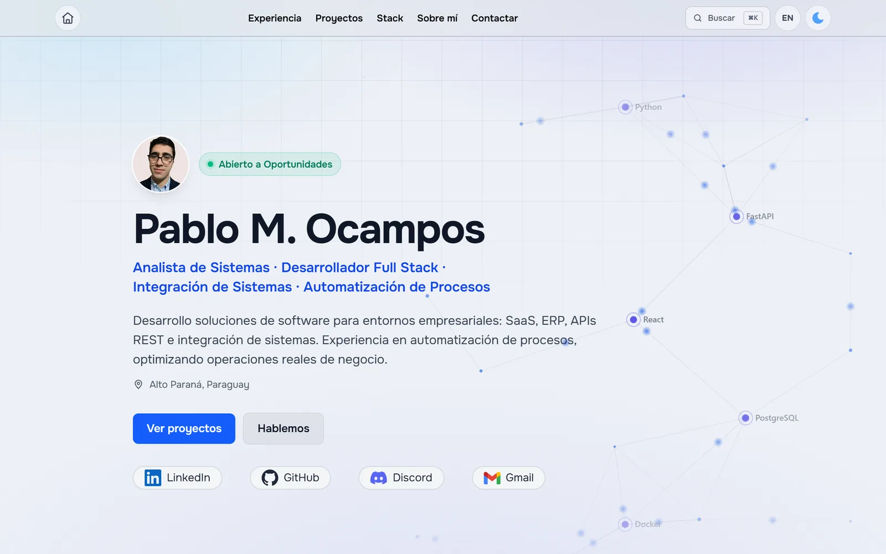

<div align="center">

# Portafolio Web

Portafolio personal bilingüe de **Pablo M. Ocampos**, desarrollador full stack.
Experiencia, proyectos, stack y contacto, en español e inglés.

[](https://portfolio-pabl0sk1.netlify.app/)
[](https://astro.build/)
[](https://tailwindcss.com/)

<picture>
  <source media="(prefers-color-scheme: dark)" srcset="docs/preview-dark.webp">
  <source media="(prefers-color-scheme: light)" srcset="docs/preview-light.webp">
  
</picture>

</div>

---

## Qué tiene

| | |
|---|---|
| 🌐 **Bilingüe de verdad** | Español en `/` e inglés en `/en/`, dos URLs reales indexables. El marcado no se duplica: cada componente detecta el idioma y saca los textos del diccionario |
| 🎨 **Tema claro y oscuro** | Por clase en `<html>`, aplicado en un script bloqueante para que la página no parpadee al cargar |
| ✨ **Hero animado** | Red de nodos dibujada a mano sobre canvas, sin librerías. Los nodos grandes llevan el logo real de cada tecnología del stack principal y reaccionan al cursor. Se pausa fuera de pantalla y se queda quieta con `prefers-reduced-motion` |
| 🧩 **Proyectos en mosaico** | Piezas de distinto tamaño según el peso del proyecto, con un panel de detalle que se despliega bajo su fila |
| 🔍 **Stack filtrable** | Al pulsar una tecnología se filtran los proyectos que la usan. El estado vive en la URL (`?tech=python`), así se puede compartir y el botón atrás funciona |
| ⌘ **Paleta de comandos** | `Ctrl/⌘ + K` para saltar a cualquier sección, proyecto o filtro |
| 📬 **Formularios Netlify** | Uno por idioma, cada uno con su página de gracias |
| ⚡ **Imágenes optimizadas** | Todas pasan por `astro:assets`: cada pantalla recibe el tamaño que le toca en lugar del archivo a tope |

## Stack

**Astro 5** · **Tailwind CSS 4** · TypeScript · pnpm · Netlify

Salida estática, sin framework de UI: todo es HTML y unos pocos scripts sueltos.

## Estructura

```
src/
  consts.ts              Fuente única de contacto y URLs del sitio
  assets/                Imágenes que procesa astro:assets
  data/                  Registro de tecnologías y datos de proyectos
  i18n/
    ui.ts                Textos de interfaz (es / en)
    content.ts           Contenido largo: experiencia, proyectos, sobre mí
    utils.ts             getLangFromUrl, useTranslations, localizePath...
  components/            Secciones y piezas de la portada
  layouts/Layout.astro   <head>, SEO, tema, área de scroll y scrollbar
  pages/
    index|thanks|404     Español, en la raíz
    en/                  Inglés, mismas páginas
```

Para añadir un idioma: una entrada en `ui.ts` y `content.ts`, y una carpeta en `pages/`.

## Desarrollo

```bash
pnpm install
pnpm dev        # servidor de desarrollo
pnpm build      # build de producción a dist/
pnpm preview    # sirve dist/ para revisar el build real
npx astro check # tipos y diagnósticos
```

Antes de commitear: `npx astro check` sin errores y `pnpm build` con 6 páginas.

## Notas

Varias decisiones del proyecto no son obvias y resuelven un bug concreto: por qué
el scroll vive en un contenedor propio y no en el `<body>`, por qué el resaltado
del menú se calcula por geometría en vez de con `IntersectionObserver`, o por qué
las reglas de Firefox y `::-webkit-scrollbar` están aisladas. Están todas
explicadas con su porqué en [`CLAUDE.md`](CLAUDE.md).

---

<div align="center">

Gracias por visitar 🙌

[Portafolio](https://portfolio-pabl0sk1.netlify.app/) · [LinkedIn](https://www.linkedin.com/in/pablo-m-ocampos-b48374381/) · [GitHub](https://github.com/Pabl0sk1)

</div>
